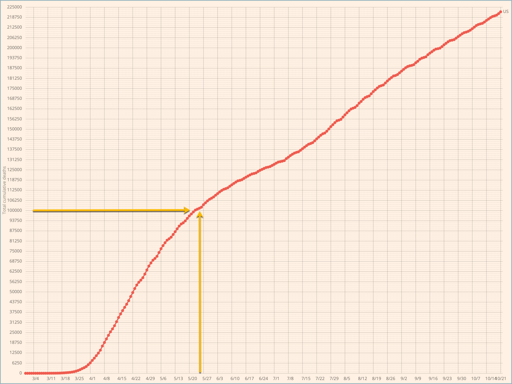

---
jupyter:
  jupytext:
    formats: ipynb,md,py:percent
    text_representation:
      extension: .md
      format_name: markdown
      format_version: '1.2'
      jupytext_version: 1.7.1
  kernelspec:
    display_name: Python 3
    language: python
    name: python3
---

# Impact of Trump super-spreader rallies on COVID-19 deaths in United States #


This project investigates the possible effects of Trump campaign rallies on the spread of COVID-19 during the summer and early fall of 2020.


## Background and Motivation ##


Prior to May 25, 2020, COVID-19 deaths in the United States were falling precipitously. On May 25th, that descent slowed dramatically, and then, around the beginning of July, reversed itself, starting a second wave of COVID-19 deaths in the United States. The number of deaths in this second wave, 125K, now exceeds that of the first wave, 100K.

The date, May 25, 2020, is significant in that it is the date on which George Floyd died while in police custody in Minneapolis, MN. Subsequent to Floyd's death, protests occurred in over 2,000 cities in the United States. It has been suggested that the George Floyd Protests might have contributed to triggering the second wave of COVID-19. 

This "hypothesis" is confounded, however, by summer political campaigning in the run up to the 2020 Elections. In particular, President Trump was notable for holding campaign rallies in which the president did not follow normative behavior to control COVID-19 infections and neither did many of the rally attendees--possibly following the president's lead. These became known as _super-spreader rallies_. Some news agencies have reported that COVID-19 infections spiked in the areas where these rallies had been recently held. However, I have not found a _systematic_ investigation of whether and to what extent the rallies were correlated with COVID-19 spread.


_**The yellow arrows in the two graphs below identify May 26, 2020, that is, the day after George Floyd died while in police custody.**_


### COVID-19 deaths: Seven day moving average ###


### COVID-19 deaths: Cumulative ###




## Research Questions and Hypothesis ##


The key question is whether it is possible to identify increases in mortality from COVID-19 subsequent to President Trump's rallies and also relatively proximal to where the rallies were held. And further, to see if these increases are greater than we would expect when compared to changes in COVID-19 mortality during the same times periods in other locations.

My hypothesis is that I _can_ identify increases in COVID-19 mortality associated with President Trump's rallies and that these increases are greater than we would expect based on contemporaneous COVID-19 mortality in other areas.


## Data ##


For data that indicates the spread of COVID-19, I will use the _COVID-19 Data Repository by the Center for Systems Science and Engineering (CSSE) at Johns Hopkins University_ hosted on GitHub at the following URL:

>  <https://github.com/CSSEGISandData/COVID-19>

For data on President Trump's campaign rallies, I will use the list maintained on Wikipedia at the following URL:

>  <https://en.wikipedia.org/wiki/List_of_post-election_Donald_Trump_rallies#2020_campaign_rallies>


## Methodology ##


The Johns-Hopkins data tracks COVID-19 deaths per county in the United States. Using geocoding, I can convert the City-State locations for President Trump's rallies into county locations. I should then be able to gather statistics for each of the counties which are also supported by the Johns-Hopkins data.

I can also gather similar statistics for a set of counties where President Trump did _not_ hold rallies and use these as something analogous to _controls_.

Specifically, the questions that I will investigate are, for each of the Trump rallies:

- What was the change in the seven-day moving average for COVID-19 deaths in the 60 days _**before**_ the date of the Trump rally in that county--and in each of the control counties.
- What was the change in the seven-day moving average for COVID-19 deaths in the 60 days _**after**_ the date of the Trump rally in that county--and in each of the control counties.

- What was the total accumulated COVID-19 deaths in the 60 days _**before**_ the date of the Trump rally in that county--and in each of the control counties.
- What was the total accumulated COVID-19 deaths in the 60 days _**after**_ the date of the Trump rally in that county--and in each of the control counties.

And also:

- Compare summary statistics (mean, median, std) for accumulated COVID-19 deaths in the Trump counties vs the control counties.

To be clear, I will look at COVID-19 deaths in the control counties before and after the date of each Trump rally _even though no Trump rally occurred in that county_.


# Deaths vs Infections ("Cases") #


Early feedback questioned measuring deaths vs infections aka "cases".

I chose to measure deaths because a "case" is typically defined simply as a positive test result. Therefore, the term case is a bit misleading in that it _seems_ to imply that someone is sick, but actually it doesn't even imply that someone is contagious or even that they are recently infected. An individual could have been infected by COVID-19 months earlier, been mostly (or perhaps completely) asymptomatic and therefore not even known that they were infected. Much later, the are tested and show up as positive. The irony of such cases is that not only is the individual not a danger to others, they actually make the community safer by virtue of their immunity.


## Unknowns that could affect the results ##


I have, so far, identified a couple unknowns that could affect the success of this investigation.

- **We don’t know how many people were at each rally.** There could be a lot of variability there, and the number of people at the rally is (almost certainly) an important factor in how many people contract the virus at the rally and therefore how much the virus could spread in the aftermath of the rally.
- **We don’t know if the people who attended a rally resided in the county where the rally was held.** They might have traveled there and then gone back home afterwards . . . and infected people in their home county. The subsequent deaths would then show up in that county rather than the one in which the rally was held. 
- **Trump's rallies are not uniformly distributed across the United States.** This could be for reasons such as campaign strategy. But in any case, regional differences between areas that hosted the rallies and those that didn't could introduce bias into the data. These differences could include local and state policies with respect to behaviors, such as masking, that affect the spread of COVID-19. Also, on a more subtle level, regional differences in culture could also affect viral spread. Some areas, irrespective of official policies, might be more or less likely to spread the vius. For example, the culture in Seattle, WA has a reputation for being somewhat insular. Early in the pandemic, the (relatively) slow community spread in Seattle was attributed to this cultural characteristic.


# Import required packages #

```python
import os
import datetime
import re
import geocoder
import numpy as np
import pandas as pd
import descartes
import geopandas as gpd
from shapely.geometry import Point, Polygon
from matplotlib import pyplot as plt
```

Import constants

```python
import constants
```

```python
#
# Note that the BING_API_KEY variable needs to be set with your API key
# in the console window from which you launch this Jupyter notebook.
#
g = geocoder.bing( 'Kenosha,s WI', key=os.environ[ 'BING_API_KEY' ] )

print( g.json[ 'raw' ][ 'address' ][ 'adminDistrict2' ] )
```

```python
trump_rallies = pd.read_csv('data/trump-rallies.csv', 
        sep=',', 
        comment='#',
        skipinitialspace=True,
        header=0,
        na_values='?')
```

```python
trump_rallies.columns
```

```python
trump_rallies.head()
```

```python
trump_rallies.tail()
```

```python
trump_rallies.shape
```

```python
target_location = trump_rallies.loc[ 0, "City" ] + ", " + trump_rallies.loc[ 0, "State" ]
target_location
```

```python
g = geocoder.bing( target_location, key=os.environ[ 'BING_API_KEY' ] )
g.json[ 'raw' ][ 'address' ][ 'adminDistrict2' ] 
```

```python
geocoder.bing( 'Newport News' + ", " + 'VA', key=os.environ[ 'BING_API_KEY' ] ).json[ 'raw' ]
```

```python
geocoder.bing( 'Newport News' + ", " + 'VA', key=os.environ[ 'BING_API_KEY' ] ).json[ 'raw' ][ 'address' ]
```

```python
def gcode( row ):
    g = geocoder.bing( row[ 'City' ] + ", " + row[ 'State' ], key=os.environ[ 'BING_API_KEY' ] )
    if 'adminDistrict2' in g.json[ 'raw' ][ 'address' ]:
        county = g.json[ 'raw' ][ 'address' ][ 'adminDistrict2' ] 
        return( county )
    else:
        return( 'Sumpter County' )

```

```python
trump_rallies[ 'County' ] = trump_rallies.apply( gcode, axis = 1 )
```

```python
trump_rallies.loc[ : , 'County' ].head()
```

```python
trump_rallies.loc[ : , 'County' ].tail()
```

# Read time series data from Johns-Hopkins COVID-19 repository #

```python
covid_19_time_series_by_county = pd.read_csv('data/time_series_covid19_deaths_US.csv', 
        sep=',', 
        comment='#',
        skipinitialspace=True,
        header=0,
        na_values='?')
```

```python
covid_19_time_series_by_county.shape
```

```python
covid_19_time_series_by_county.head()
```

```python
covid_19_time_series_by_county.tail()
```

Most of the columns are the COVID-19 deaths for a given date. Show the non-date columns.

```python
covid_19_time_series_by_county.columns.array[ 0:12 ]
```

The `Admin2` column contains the county. There are many duplicates in that column; we can't merge on it.

```python
len( covid_19_time_series_by_county.loc[ :, 'Admin2' ] ) 
```

```python
len( covid_19_time_series_by_county.loc[ :, 'Admin2' ].unique() )
```

The `Combined_Key` column provides a _primary key_ that uniquely identifies the row.

```python
covid_19_time_series_by_county.loc[ :, 'Combined_Key' ]
```

Remove unneeded columns.

```python
covid_19_time_series_by_county.drop( [ 'UID', 'iso2', 'iso3', 'code3', 'FIPS', 'Admin2', 'Province_State', 'Country_Region' ] , axis = 1, inplace = True )
```

```python
covid_19_time_series_by_county.head()
```

# Synthesize a key for the Trump rallies dataframe to use for merging #


Read in a dataset that maps from state names to state abbreviations.

```python
state_abbr = pd.read_csv('data/state-abbr.csv', 
        sep=',', 
        comment='#',
        skipinitialspace=True,
        header=0,
        na_values='?')
```

```python
state_abbr.head()
```

```python
state_abbr.tail()
```

Create a dictionary from the two columns of our state/abbr dataframe.

```python
map_abbr_state = dict( zip( state_abbr.Abbr.str.strip(), state_abbr.State.str.strip() ) )
```

```python
map_abbr_state.keys()
```

```python
map_abbr_state[ 'VA' ]
```

```python
def create_combined_key_for_trump( row ):
    combined = row[ 'County' ][ 0:-6 ].rstrip() + ", " + map_abbr_state[ row[ 'State' ] ] + ", " + 'US'
    return combined

trump_rallies[ 'Combined_Key' ] = trump_rallies.apply( create_combined_key_for_trump, axis = 1 )
```

```python
trump_rallies[ 'Combined_Key' ].head()
```

```python
trump_rallies.head()
```

# Merge Trump rallies data with COVID-19 data #

```python
trump_rallies = trump_rallies.merge( covid_19_time_series_by_county, how = "left", on = "Combined_Key")
```

```python
trump_rallies.columns
```

```python
trump_rallies.shape
```

```python
trump_rallies.head()
```

```python
trump_rallies.tail(10)
```

# Derive a table that has only the COVID-19 deaths by rally location #


Drop columns that are unecessary for this table

```python
covid_19_deaths_by_rally = trump_rallies.drop( ["Date", "City", "State", "County", "Lat", "Long_", "Population" ], axis = 1 )
covid_19_deaths_by_rally.head()
```

Trump visited the following counties twice, which creates duplicate rows in the dataframe.

- Maricopa, Arizona, US
- Douglas, Nevada, US
- Cumberland, North Carolina, US

Drop those duplicate rows.

```python
len( covid_19_deaths_by_rally ) - len( covid_19_deaths_by_rally.drop_duplicates() )
```

```python
covid_19_deaths_by_rally.drop_duplicates( inplace = True )
len( covid_19_deaths_by_rally ) - len( covid_19_deaths_by_rally.drop_duplicates() )
```

Dropping rows leaves gaps in the index. For example, note that `29` is missing below. Renumber the index.

```python
covid_19_deaths_by_rally.index
```

```python
covid_19_deaths_by_rally.set_index( pd.Int64Index( range( covid_19_deaths_by_rally.shape[ 0 ] ) ), inplace = True )
covid_19_deaths_by_rally.index
```

Swap the rows and columns

```python
covid_19_deaths_by_rally = covid_19_deaths_by_rally.transpose()
covid_19_deaths_by_rally.head()
```

Use the first row as the column labels

```python
covid_19_deaths_by_rally.columns = covid_19_deaths_by_rally.iloc[0]
covid_19_deaths_by_rally.drop(covid_19_deaths_by_rally.index[0], inplace = True )
covid_19_deaths_by_rally.head()
```

Fix up name of first column. View the tail of the dataframe so we can see the number of deaths at the end of the time interval.

```python
covid_19_deaths_by_rally.columns.name = ""
covid_19_deaths_by_rally.tail()
```

The Trump rallies dataframe uses dates in ISO 8601 format. Convert the dates in the COVID-19 deaths table to use the same format.

```python
def convert_to_iso( string ):
    m = re.match( '(\d*)/(\d*)/(\d*)', string )
    my_date = datetime.date( int( '20' + m.group( 3 ) ), int( m.group( 1 ) ), int( m.group( 2 ) ) )
    return( my_date.isoformat() )

date_index = covid_19_deaths_by_rally.index
iso_index = date_index.map( convert_to_iso )
covid_19_deaths_by_rally.index = iso_index
```

```python
covid_19_deaths_by_rally.head()
```

# Remove the COVID-19 deaths from the Trump rallies table #

```python
trump_rallies.drop( trump_rallies.iloc[:, 8:], axis = 1, inplace = True )
trump_rallies.head()
```

```python
trump_rallies[ trump_rallies.Date == "2020-08-17" ]
```

```python
trump_rallies.loc[ 2, 'Combined_Key' ]
```

The time series data from Johns-Hopkins is cumulative. We want the number of deaths on a particular day, rather than the total number of deaths up until that day. Use the `.diff()` method to the differences between each row in the dataframe.

```python
covid_19_deaths_by_rally_no_accumulate = covid_19_deaths_by_rally.diff(periods=1, axis=0)
```

```python
covid_19_deaths_by_rally.tail()
```

```python
covid_19_deaths_by_rally_no_accumulate.tail()
```

```python
covid_19_deaths_by_rally.loc[ trump_rallies.loc[ 2, 'Date'], trump_rallies.loc[ 2, 'Combined_Key'] ]
```

```python
covid_19_deaths_by_rally.loc[ :, trump_rallies.loc[ 2, 'Combined_Key'] ].max()
```

```python
my_date = datetime.date(2020, 12,14)
time_interval = datetime.timedelta( days = constants.TIME_INTERVAL )

rally_date_str = trump_rallies.loc[ 1, 'Date']

before_date_str = ( my_date.fromisoformat( rally_date_str ) - time_interval ).isoformat()
after_date_str = ( my_date.fromisoformat( rally_date_str ) + time_interval ).isoformat()
```

Deaths each day for `TIME_INTERVAL` days _prior_ to Trump's rally.

```python
covid_19_deaths_by_rally_no_accumulate.loc[ :, trump_rallies.loc[ 0, 'Combined_Key'] ].loc[ before_date_str:rally_date_str ]
```

```python
covid_19_deaths_by_rally_no_accumulate.loc[ :, trump_rallies.loc[ 0, 'Combined_Key'] ].loc[ before_date_str:rally_date_str ].sum()
```

```python
covid_19_deaths_by_rally_no_accumulate.loc[ :, trump_rallies.loc[ 1, 'Combined_Key'] ].loc[ before_date_str:rally_date_str ].sum()
```

```python
covid_19_deaths_by_rally_no_accumulate.loc[ :, trump_rallies.loc[ 48, 'Combined_Key'] ].loc[ before_date_str:rally_date_str ].sum()
```

```python
covid_19_deaths_by_rally_no_accumulate.loc[ :, trump_rallies.loc[ 2, 'Combined_Key'] ].loc[ before_date_str:rally_date_str ].sum()
```

```python
covid_19_deaths_by_rally_no_accumulate.loc[ :, trump_rallies.loc[ 3, 'Combined_Key'] ].loc[ before_date_str:rally_date_str ].sum()
```

```python
covid_19_deaths_by_rally_no_accumulate.loc[ :, trump_rallies.loc[ 4, 'Combined_Key'] ].loc[ before_date_str:rally_date_str ].sum()
```

```python
def deaths_prior( row ):
    time_interval = datetime.timedelta( days = constants.TIME_INTERVAL )
    rally_date_str = row[ 'Date'] 
    before_date_str = ( my_date.fromisoformat( rally_date_str ) - time_interval ).isoformat()
    return( covid_19_deaths_by_rally_no_accumulate.loc[ :, row[ 'Combined_Key' ] ].loc[ before_date_str:rally_date_str ].sum() )

trump_rallies[ "deaths_prior" ] = trump_rallies.apply( deaths_prior, axis = 1 )
```

```python
def deaths_after( row ):
    time_interval = datetime.timedelta( days = constants.TIME_INTERVAL )
    rally_date_str = row[ 'Date'] 
    after_date_str = ( my_date.fromisoformat( rally_date_str ) + time_interval ).isoformat()
    return( covid_19_deaths_by_rally_no_accumulate.loc[ :, row[ 'Combined_Key' ] ].loc[ rally_date_str:after_date_str ].sum() )

trump_rallies[ "deaths_after" ] = trump_rallies.apply( deaths_after, axis = 1 )
```

```python
def percent_change( row ):
    deaths_prior = row[ "deaths_prior" ]
    deaths_after = row[ "deaths_after" ]
    if ( (deaths_prior) == 0 ):
        return( 0 )
    if ( (deaths_after) == 0 ):
        return( 0 )
    if ( deaths_prior < deaths_after ):
        change = ( deaths_after - deaths_prior ) / deaths_prior
    else:
        change = (-1) * ( deaths_prior - deaths_after ) / deaths_prior 
                
    return( round( change * 100, 2 ) )
    
trump_rallies[ "percent_change" ] = trump_rallies.apply( percent_change, axis = 1 )
```

Deaths each day for `TIME_INTERVAL` days _after_ Trump's rally.

```python
trump_rallies.head( 35 )
```

```python
trump_rallies.tail( 35 )
```

```python
trump_rally_locations = trump_rallies.drop( ["Date", "State", "County", "Combined_Key", "Population", "deaths_prior", "deaths_after" ], axis = 1 )
trump_rally_locations.head()
```

```python
trump_rallies.to_csv( 'data/trump-rallies-augmented.csv', index_label = 'Id' )
```

```python
trump_rally_locations.to_csv( 'data/trump-rally-locations.csv', index_label = 'Id' )
```

```python
figure_size = [ 18, 5 ]
fig_1, ax = plt.subplots()

trump_rallies[ 'percent_change' ].hist( figsize = figure_size )

plt.ylabel("Number of counties",fontsize=12)
plt.xlabel("Percentage change",fontsize=12)
# plt.title('Post-Rally COVID-19 Spread', fontsize=15)
#
# Summary statistics: mean and std
#
mean_change = trump_rallies[ 'percent_change' ].mean()
std_change = trump_rallies[ 'percent_change' ].std()
median_change = trump_rallies[ 'percent_change' ].median()

s = "Median: {0:.3}\nMean: {1:.3}\nStd: {2:.3}".format( median_change, mean_change, std_change)
plt.text(1200, 22, s )

#
# Indicate mean and std with vertical lines
#
plt.axvline(x=median_change, color='orange', linewidth = 4)
plt.axvline(x=mean_change, color='red', linewidth = 4)
plt.axvline(x=mean_change + std_change, color='green', linewidth = 4)
plt.axvline(x=mean_change - std_change, color='green', linewidth = 4)
```

```python
fig_1.savefig( "viz/hist-counties-by-percent-change.png", bbox_inches = 'tight' )
```

```python
us_map = gpd.read_file( "data/tl_2019_us_state/tl_2019_us_state.shp" )
fig, ax = plt.subplots( figsize = ( 30, 30 ))
ax.set_xlim(-130, -65)
ax.set_ylim(22, 50)
us_map.plot( ax = ax )
```

# Acknowledgements #

Resources that I learned from while producing this notebook.


## Constants in Python ##
Guidance on emulating constants in Python from Jonathan Hsu at [Medium](https://medium.com/better-programming/does-python-have-constants-3b8249dc8b7b)


## GeoPandas ##

_GeoPandas 101: Plot any data with a latitude and longitude on a map_ by Ryan Stewart at [TowardsDataScience](https://towardsdatascience.com/geopandas-101-plot-any-data-with-a-latitude-and-longitude-on-a-map-98e01944b972)

GeoPandas install [documentation](https://geopandas.org/install.html)


### --- END --- ###
