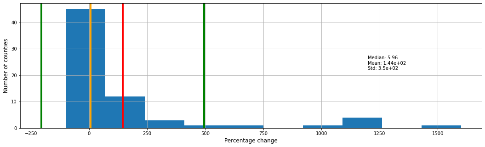
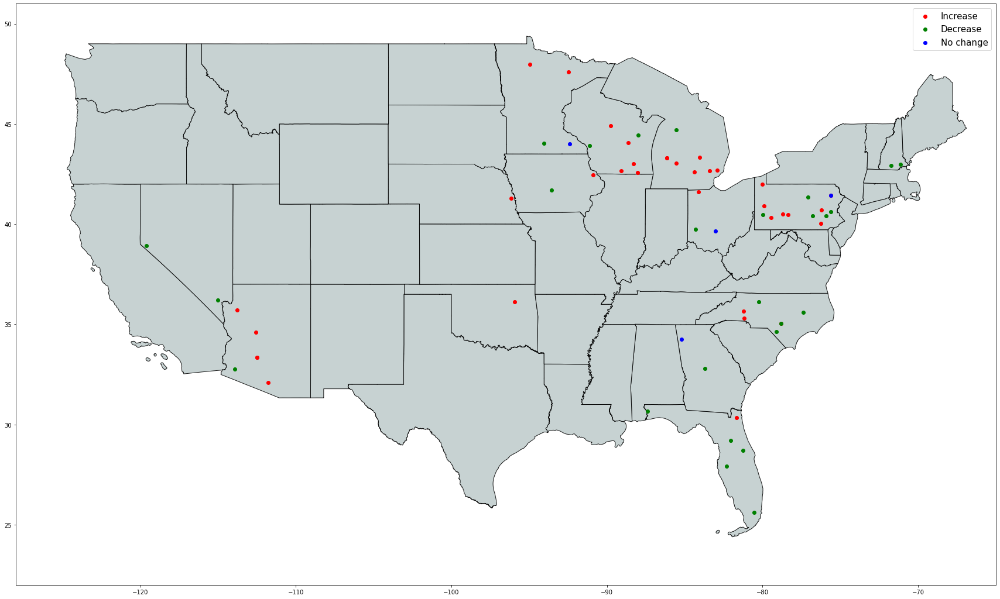

---
jupyter:
  jupytext:
    formats: ipynb,md,py:percent
    text_representation:
      extension: .md
      format_name: markdown
      format_version: '1.2'
      jupytext_version: 1.7.1
  kernelspec:
    display_name: Python 3
    language: python
    name: python3
---

# Impact of Trump super-spreader rallies on COVID-19 deaths in United States #


This project investigates the possible effects of Trump campaign rallies on the spread of COVID-19 during the summer and early fall of 2020.


## Background and Motivation ##


Prior to May 25, 2020, COVID-19 deaths in the United States were falling precipitously. On May 25th, that descent slowed dramatically, and then, around the beginning of July, reversed itself, starting a second wave of COVID-19 deaths in the United States. The number of deaths in this second wave, 125K, now exceeds that of the first wave, 100K.

The date, May 25, 2020, is significant in that it is the date on which George Floyd died while in police custody in Minneapolis, MN. Subsequent to Floyd's death, protests occurred in over 2,000 cities in the United States. It has been suggested that the George Floyd Protests might have contributed to triggering the second wave of COVID-19. 

This "hypothesis" is confounded, however, by summer political campaigning in the run up to the 2020 Elections. In particular, President Trump was notable for holding campaign rallies in which the president did not follow normative behavior to control COVID-19 infections and neither did many of the rally attendees--possibly following the president's lead. These became known as _super-spreader rallies_. 


_**The yellow arrows in the two graphs below identify May 26, 2020, that is, the day after George Floyd died while in police custody.**_


### COVID-19 deaths: Seven day moving average ###


## Research Question and Hypothesis ##


My research question is whether it is possible to identify increases in the spread of COVID-19 subsequent to President Trump's rallies and also proximal to where the rallies were held. 

My hypothesis is that I _can_ identify increases in COVID-19 mortality associated with President Trump's rallies and that these increases are greater than we would expect given the incidence of COVID-19 prior to each rally.


## Data ##


For data that indicates the **spread of COVID-19**, I use the _COVID-19 Data Repository by the Center for Systems Science and Engineering (CSSE) at Johns Hopkins University_ hosted on [GitHub](https://github.com/CSSEGISandData/COVID-19).

For data on **President Trump's campaign rallies**, I use the [list maintained on Wikipedia](https://en.wikipedia.org/wiki/List_of_post-election_Donald_Trump_rallies#2020_campaign_rallies).

For the **county locations** for President Trump's rallies, I use geocoding information from Bing obtained via the [`geocoder` package](https://geocoder.readthedocs.io/providers/Bing.html).


## Methodology ##


The Johns-Hopkins data tracks COVID-19 deaths _per county_ in the United States. Using geocoding, I convert the City-State locations for President Trump's rallies, from Wikipedia, into county locations. I then collect COVID-19 related death statistics for each of the counties from the Johns-Hopkins data.

I compare the number of deaths for a specific time interval _before_ each rally to the number of deaths for that same time interval _after_ the rally. I represent this comparison as a percentage change. I expect this percentage to be uniformly greater than one.

_The time interval I have chosen is **42 days (six weeks)**._ This is the longest interval that I could use and still include the most-recent rallies that occurred on November 2, 2020.


## Deaths vs Infections ("Cases") ##


Early feedback questioned measuring deaths vs infections aka "cases".

A _**case**_ is typically defined simply as a positive test result. Therefore, the term _case_ is a bit misleading in that it _seems_ to imply that someone is sick, but actually it doesn't imply that someone is symptomatic or that they are contagious or even that they are recently infected. An individual could have been infected by COVID-19 months earlier, been mostly (or perhaps completely) asymptomatic and therefore not even know that they were infected. Much later, they are tested and show up as positive. The irony of such cases is that not only is the individual not a danger to others, they actually make the community safer by virtue of their immunity.

At the same time, measuring deaths is not without issues either. The main issue is that there might be a significant interval between when an individual is infected by COVID-19 and when they die. For the purposes of this project--in which I am trying to measure the contribution of President Trump's rallies to the spread of the virus--if I measure deaths inside a relatively short interval after the rally then I risk not capturing those deaths that haven't yet occurred. On the other hand, if I extend the interval, I risk that the deaths that I capture in the data might actually have been caused by viral spread from other factors.

All that said, I chose to measure deaths rather than cases. In addition to the factors above, I chose deaths because, in the final analysis, it is the outcome that we care most about. If people only became infected with COVID-19, but never died, the current pandemic would probably have much less urgency.


## Limitations: Unknowns that could affect the results ##


I have, so far, identified a number of unknowns that could affect the accuracy of the results of this investigation.

- **We don’t know how many people were at each rally.** There could be a lot of variability there, and the number of people at the rally is (almost certainly) an important factor in how many people contract the virus at the rally and therefore how much the virus could spread in the aftermath of the rally.
- **We don’t know if the people who attended a rally resided in the county where the rally was held.** They might have traveled there and then gone back home afterwards . . . and infected people in their home county. The subsequent deaths would then show up in that county rather than the one in which the rally was held. 
- **Trump's rallies are not uniformly distributed across the United States.** This could be for reasons such as campaign strategy. But in any case, regional differences between areas that hosted the rallies and those that didn't could introduce bias into the data. These differences could include local and state policies with respect to behaviors, such as masking, that affect the spread of COVID-19. Also, on a more subtle level, regional differences in culture could also affect viral spread. Some areas, irrespective of official policies, might be more or less likely to spread the vius. For example, the culture in Seattle, WA has a reputation for being somewhat insular. Early in the pandemic, the (relatively) slow community spread in Seattle was attributed to this cultural characteristic.


## Prior work: Stanford University Study ##


I was able to find only a single investigation into the effects of President Trump's rallies on the spread of COVID-19: [The Effects of Large Group Meetings on the Spread of COVID-19: The Case of Trump Rallies (October, 2020)](https://siepr.stanford.edu/research/publications/effects-large-group-meetings-spread-covid-19-case-trump-rallies) by B. Douglas Bernheim, Nina Buchmann, Zach Freitas-Groff, Sebastián Otero of Stanford University's Institute for Economic Policy Research (SIEPR). 

The study investigated 18 rallies between June 20, 2020 and September 22, 2020. It uses COVID-19 case data from the Johns-Hopkins data respository. It analyzes the data for the county where each rally was held for the ten weeks following the rally. It compares the number of cases during this period with number of cases in a "placebo" county that did not host a Trump rally. The study estimate that the 18 Trump rallies resulted in more than 30,000 incremental cases of COVID-19 and 700 deaths. 

Considerations with the Stanford study and comparison to the current study:

- The Stanford study investigates **18** rallies; the current study investigates **68** rallies.
- The Stanford study compares the counties where rallies were held _to placebo counties_; the current study compares each county _to itself pre and post the rally date_.
- Both the Stanford study and the current study use data from the Johns-Hopkins data repository.
- The Stanford study uses **case data**; the current study uses **mortality data (deaths)**. 
- The Stanford study tracks COVID-19 cases for the **ten weeks** following each rally; the curent study tracks deaths for the **six weeks** following each rally
- The Stanford study's estimate of 700 deaths is based on the _death rate_ for the county in question. It is not clear why the Stanford study didn't directly use the mortality data from Johns-Hopkins.
- Although the Stanford study compares the Trump-rally counties to placebo counties, it doesn't provide the names of the placebo counties. Therefore, reproducibility of the Stanford study is hindered.
- For the current study, I also considered comparing to a set of _control counties_. However, selecting a set of such counties turned out to be remarkably fraught; so instead, I settled on a much simpler methodology. It is dissapointing that the Stanford researchers do not provide their placebo counties or their criteria for selecting them.


## Findings ##


(The code that produced the visualizations in this section is available in the **Implementation** section of this notebook.)


I found that in **39** counties, the number of deaths following a Trump rally increased, sometimes dramatically. In **25** counties, the number of deaths following a Trump rally decreased. And in **4** counties, the number of deaths stayed the same--that is, there were no deaths before or after the rally.


The following histogram shows the distributions of the percentages. From the histogram, you can see that the mean percentage increase is 140%. Note however, that while increases can go above 100%, decreases are capped at 100%, so this could account to some extent for the right-skewing of the histogram. Note also that the median at 14.2 is relatively close to zero, which reflects that subsequent to a fair percentage of the rallies COVID-19 deaths either decreased or stayed the same.





The following geospatial plot shows the distribution of the rallies in the United States and which rallies showed increases or decreases. Note that the plot seems to indicate clustering both at the state level (Arizona and Florida) and within states (Michigan, Pennsylvania, North Carolina).





The following time-series plot shows whether rallies at a particular point in time were followed by increases (red) or decreases (green) in COVID-19 deaths. Yellow indicates no change. From the plot, it appears that the number of rallies that result in increases is higher later in the year than earlier in the year. Also, the number of high-magnitude increases is somewhat greater toward the end of the year.


## Conclusions ##


Overall, the findings appear to be inconclusive. 

I did find many (39) locations in which COVID-19 deaths increased in the aftermath of Trump campaign rallies--and in some cases, these increases were dramatic.

However, there were also many locations (29) in which deaths stayed the same or declined.

Also, the increases in the COVID-19 related deaths appear to be clustered which suggests that regional factors contributed to COVID-19 spread rather than (only) the Trump rally. Finally, COVID-19 related deaths following Trump rallies appear to increase with time, that is, they mirror the general progression of the pandemic, which again suggests that the Trump rally is not the (only) contributing factor.


# Implementation #


## Import required packages ##

```python
import os
import datetime
import re
import geocoder
import numpy as np
import pandas as pd
import descartes
import geopandas as gpd
from shapely.geometry import Point, Polygon
from matplotlib import pyplot as plt
```

## Import constants used in the code ##

```python
import constants
```

## Show the constants ##

```python
!cat constants.py
```

## Read location data for Trump rallies ##

```python
trump_rallies = pd.read_csv('data/trump-rallies.csv', 
        sep=',', 
        comment='#',
        skipinitialspace=True,
        header=0,
        na_values='?')
```

### View the Trump rally data ###

```python
trump_rallies.head()
```

```python
trump_rallies.tail()
```

## Use geocoding to obtain county locations for the Trump rallies ##

```python
geocoder.bing( 'Newport News' + ", " + 'VA', key=os.environ[ 'BING_API_KEY' ] ).json[ 'raw' ]
```

```python
geocoder.bing( 'Newport News' + ", " + 'VA', key=os.environ[ 'BING_API_KEY' ] ).json[ 'raw' ][ 'address' ]
```

### Use `apply` to create an additional column with the county information ###

```python
def gcode( row ):
    g = geocoder.bing( row[ 'City' ] + ", " + row[ 'State' ], key=os.environ[ 'BING_API_KEY' ] )
    if 'adminDistrict2' in g.json[ 'raw' ][ 'address' ]:
        county = g.json[ 'raw' ][ 'address' ][ 'adminDistrict2' ] 
        return( county )
    else:
        return( 'Sumpter County' )

trump_rallies[ 'County' ] = trump_rallies.apply( gcode, axis = 1 )
```

```python
trump_rallies.head()
```

## Read time series data for COVID-19 deaths from the Johns-Hopkins repository ##

```python
covid_19_time_series_by_county = pd.read_csv('data/time_series_covid19_deaths_US.csv', 
        sep=',', 
        comment='#',
        skipinitialspace=True,
        header=0,
        na_values='?')
```

### View the time series data ###

```python
covid_19_time_series_by_county.head()
```

```python
covid_19_time_series_by_county.tail()
```

## Merge Trump rallies data with COVID-19 data ##


We need to merge the dataframe that contains the Trump rally information with the dataframe that contains the COVID-19 deaths by county and date.


### The county column ( `Admin2`) contains many duplicates ###


The `Admin2` column contains the county. However, we can't use it to merge because it contain many duplicates.

```python
len( covid_19_time_series_by_county.loc[ :, 'Admin2' ] ) - len( covid_19_time_series_by_county.loc[ :, 'Admin2' ].unique() )
```

The `Combined_Key` column provides a _primary key_ that uniquely identifies each row.

```python
covid_19_time_series_by_county.loc[ :, 'Combined_Key' ]
```

### Synthesize a key for the Trump rallies dataframe to use for merging ###


Read in a dataset that maps from state names to state abbreviations.

```python
state_abbr = pd.read_csv('data/state-abbr.csv', 
        sep=',', 
        comment='#',
        skipinitialspace=True,
        header=0,
        na_values='?')

state_abbr.head()
```

Create a dictionary from the two columns of our state/abbr dataframe.

```python
map_abbr_state = dict( zip( state_abbr.Abbr.str.strip(), state_abbr.State.str.strip() ) )

map_abbr_state.keys()
```

Test our dictionary.

```python
map_abbr_state[ 'VA' ]
```

### Use `apply` to add a `Combined_Key` column to the Trump rallies dataframe ###

```python
def create_combined_key_for_trump( row ):
    combined = row[ 'County' ][ 0:-6 ].rstrip() + ", " + map_abbr_state[ row[ 'State' ] ] + ", " + 'US'
    return combined

trump_rallies[ 'Combined_Key' ] = trump_rallies.apply( create_combined_key_for_trump, axis = 1 )

trump_rallies.head()
```

### Remove unneeded columns from COVID-19 dataframe prior to merge ###

```python
covid_19_time_series_by_county.drop( [ 'UID', 'iso2', 'iso3', 'code3', 'FIPS', 'Admin2', 'Province_State', 'Country_Region' ] , axis = 1, inplace = True )
covid_19_time_series_by_county.head()
```

### Perform the merge on the the `Combined_Key` column ###


Because this is a _left merge_, it removes any data coming in from the COVID-19 dataframe that is not relevant to the Trump rallies.

```python
trump_rallies = trump_rallies.merge( covid_19_time_series_by_county, how = "left", on = "Combined_Key")

trump_rallies.head()
```

## Derive a table that has only the COVID-19 deaths by rally location ##


Drop columns that are unecessary for this table

```python
covid_19_deaths_by_rally = trump_rallies.drop( ["Date", "City", "State", "County", "Lat", "Long_", "Population" ], axis = 1 )
covid_19_deaths_by_rally.head()
```

### Remove duplicate rows from dataframe ###


Trump visited the following counties more than once, which creates duplicate rows in the dataframe.

- Maricopa, Arizona, US
- Douglas, Nevada, US
- Cumberland, North Carolina, US

```python
len( covid_19_deaths_by_rally ) - len( covid_19_deaths_by_rally.drop_duplicates() )
```

Drop those duplicate rows.

```python
covid_19_deaths_by_rally.drop_duplicates( inplace = True )
len( covid_19_deaths_by_rally ) - len( covid_19_deaths_by_rally.drop_duplicates() )
```

### Repair the index after dropping duplicate rows ###


Dropping rows leaves gaps in the index. For example, note that `29` is missing below. 

```python
covid_19_deaths_by_rally.index
```

Renumber the index.

```python
covid_19_deaths_by_rally.set_index( pd.Int64Index( range( covid_19_deaths_by_rally.shape[ 0 ] ) ), inplace = True )
covid_19_deaths_by_rally.index
```

## Reconfigure dataframe so that counties are columns and dates are rows ##


Swap the rows and columns

```python
covid_19_deaths_by_rally = covid_19_deaths_by_rally.transpose()
covid_19_deaths_by_rally.head()
```

Use the first row as the column labels

```python
covid_19_deaths_by_rally.columns = covid_19_deaths_by_rally.iloc[0]
covid_19_deaths_by_rally.drop(covid_19_deaths_by_rally.index[0], inplace = True )
covid_19_deaths_by_rally.head()
```

Fix up name of first column. View the tail of the dataframe so we can see the number of deaths at the end of the time interval.

```python
covid_19_deaths_by_rally.columns.name = ""
covid_19_deaths_by_rally.tail()
```

## Use same date format (ISO 8601) for both Trump rallies and COVID-19 times series data ##


The Trump rallies dataframe uses dates in ISO 8601 format. Convert the dates in the COVID-19 deaths table to use the same format.

```python
def convert_to_iso( string ):
    m = re.match( '(\d*)/(\d*)/(\d*)', string )
    my_date = datetime.date( int( '20' + m.group( 3 ) ), int( m.group( 1 ) ), int( m.group( 2 ) ) )
    return( my_date.isoformat() )

#
# Get the current index
#
date_index = covid_19_deaths_by_rally.index

#
# Convert it to ISO 8601
#
iso_index = date_index.map( convert_to_iso )

#
# Replace the index in the dataframe with the converted index
#
covid_19_deaths_by_rally.index = iso_index

covid_19_deaths_by_rally.head()
```

## Remove the COVID-19 deaths from the Trump rallies table ##

```python
trump_rallies.drop( trump_rallies.iloc[:, 8:], axis = 1, inplace = True )

trump_rallies.head()
```

## Convert COVID-19 accumulated deaths to death per day ##


The time series data from Johns-Hopkins is cumulative. We want the number of deaths on a particular day, rather than the total number of deaths up until that day. Use the `.diff()` method to get the differences between each row in the dataframe.

```python
covid_19_deaths_by_rally_no_accumulate = covid_19_deaths_by_rally.diff(periods=1, axis=0)
```

```python
covid_19_deaths_by_rally.tail()
```

```python
covid_19_deaths_by_rally_no_accumulate.tail()
```

## Use `apply` to create three new columns: Deaths prior, deaths after, and percentage change ##


Create a `datetime` object to use for data calculations. The date used in the constructor is arbitary.

```python
my_date = datetime.date(2020, 12, 14)
```

### Deaths each day for `TIME_INTERVAL` days _prior_ to Trump's rally ###

```python
def deaths_prior( row ):
    time_interval = datetime.timedelta( days = constants.TIME_INTERVAL )
    rally_date_str = row[ 'Date'] 
    before_date_str = ( my_date.fromisoformat( rally_date_str ) - time_interval ).isoformat()
    return( covid_19_deaths_by_rally_no_accumulate.loc[ :, row[ 'Combined_Key' ] ].loc[ before_date_str:rally_date_str ].sum() )

trump_rallies[ "deaths_prior" ] = trump_rallies.apply( deaths_prior, axis = 1 )
```

### Deaths each day for `TIME_INTERVAL` days _after_ Trump's rally ###

```python
def deaths_after( row ):
    time_interval = datetime.timedelta( days = constants.TIME_INTERVAL )
    rally_date_str = row[ 'Date'] 
    after_date_str = ( my_date.fromisoformat( rally_date_str ) + time_interval ).isoformat()
    return( covid_19_deaths_by_rally_no_accumulate.loc[ :, row[ 'Combined_Key' ] ].loc[ rally_date_str:after_date_str ].sum() )

trump_rallies[ "deaths_after" ] = trump_rallies.apply( deaths_after, axis = 1 )
```

### Percentage change in deaths from before Trump's rally to after  ###

```python
def percent_change( row ):
    deaths_prior = row[ "deaths_prior" ]
    deaths_after = row[ "deaths_after" ]
    if ( (deaths_prior) == (deaths_after) ):
        return( 0 )
    if ( deaths_prior < deaths_after ):
        change = ( deaths_after - deaths_prior ) / ( 1 if deaths_prior == 0 else deaths_prior )
    else:
        change = (-1) * ( deaths_prior - deaths_after ) / ( 1 if deaths_prior == 0 else deaths_prior )                 
    return( round( change * 100, 2 ) )
    
trump_rallies[ "percent_change" ] = trump_rallies.apply( percent_change, axis = 1 )
```

## View the entire table ##

```python
trump_rallies.head( 35 )
```

```python
trump_rallies.tail( 35 )
```

### Number of counties where COVID-19 deaths increased ###

```python
trump_rallies[ trump_rallies[ "percent_change" ] > 0 ][ "percent_change" ].count()
```


### Number of counties where COVID-19 deaths decreased ###

```python
trump_rallies[ trump_rallies[ "percent_change" ] < 0 ][ "percent_change" ].count()
```

### Number of counties where COVID-19 deaths stayed the same ###

```python
trump_rallies[ trump_rallies[ "percent_change" ] == 0 ][ "percent_change" ].count()
```

## Histogram to see distribution of percentages ##

```python
figure_size = [ 18, 5 ]
fig_1, ax = plt.subplots()

trump_rallies[ 'percent_change' ].hist( figsize = figure_size )

plt.ylabel("Number of counties",fontsize=12)
plt.xlabel("Percentage change",fontsize=12)
# plt.title('Post-Rally COVID-19 Spread', fontsize=15)
#
# Summary statistics: mean and std
#
mean_change = trump_rallies[ 'percent_change' ].mean()
std_change = trump_rallies[ 'percent_change' ].std()
median_change = trump_rallies[ 'percent_change' ].median()

s = "Median: {0:.3}\nMean: {1:.3}\nStd: {2:.3}".format( median_change, mean_change, std_change)
plt.text(1200, 22, s )

#
# Indicate mean and std with vertical lines
#
plt.axvline(x=median_change, color='orange', linewidth = 4)
plt.axvline(x=mean_change, color='red', linewidth = 4)
plt.axvline(x=mean_change + std_change, color='green', linewidth = 4)
plt.axvline(x=mean_change - std_change, color='green', linewidth = 4)
```

**Persist** this figure and the augmented dataframe for Trump's rallies.

```python
fig_1.savefig( "viz/hist-counties-by-percent-change.png", bbox_inches = 'tight' )
trump_rallies.to_csv( 'data/trump-rallies-augmented.csv', index_label = 'Id' )
```

## Geospatial plots ##


Derive a smaller geo-dataframe that we will use for the geospatial plot.

```python
#
# Drop unecessary columns
#
trump_rally_locations = trump_rallies.drop( ["Date", "State", "County", "Combined_Key", "Population", "deaths_prior", "deaths_after" ], axis = 1 )

# 
# Create mappable Points from the Lat and Long_ columns
#
trump_rally_geo_points = [Point( xy ) for xy in zip( trump_rally_locations[ "Long_" ], trump_rally_locations[ "Lat" ] ) ]

#
# Create the geo-dataframe using geopandas
#
trump_rally_locations_geo = gpd.GeoDataFrame( trump_rally_locations, crs = "EPSG:4326", geometry = trump_rally_geo_points )

trump_rally_locations_geo.head()
```

Use the geo-dataframe to construct the geospatial plot.

```python
#
# Create the base plot
#
fig, ax = plt.subplots( figsize = ( 30, 30 ))

#
# Plot the US map
#
us_map = gpd.read_file( "data/tl_2019_us_state/tl_2019_us_state.shp" )
us_map.plot( ax = ax, color = "#C1CDCD", alpha = 0.9, edgecolor = "black" )

#
# Scope the plot to show only the continental US
#
ax.set_xlim(-128, -65)
ax.set_ylim(22, 51)

#
# Add the colored data points
#
trump_rally_locations_geo[ trump_rally_locations_geo[ "percent_change" ] > 0 ].plot( ax = ax, color = "red", label = "Increase" )
trump_rally_locations_geo[ trump_rally_locations_geo[ "percent_change" ] < 0 ].plot( ax = ax, color = "green", label = "Decrease" )
trump_rally_locations_geo[ trump_rally_locations_geo[ "percent_change" ] == 0 ].plot( ax = ax, color = "yellow", label = "No change" )

#
# Add the legend
#
plt.legend( prop = {'size':15})

```

**Persist** this figure and the data.

```python
fig.savefig( "viz/geo-rallies-and-impact.png", bbox_inches = 'tight' )
trump_rally_locations.to_csv( 'data/trump-rally-locations.csv', index_label = 'Id' )
```

## Time series plot for Trump rallies ##


Derive a new dataframe to use for a time-series plot.

```python
#
# Drop unecessary columns
#
trump_rallies_time_series = trump_rallies.drop( [ "Population", "Lat", "Long_", "deaths_prior", "deaths_after" ], axis = 1 )

#
# Use `apply` to add a new columns for the colors of the marks 
#
def rally_colors( row ):
    if row[ "percent_change" ] < 0:
        return( "green" )
    elif row[ "percent_change" ] > 0:
        return( "red" )
    elif row[ "percent_change" ] == 0:
        return( "black" )
    
trump_rallies_time_series[ "mark_color" ] = trump_rally_time_series.apply( rally_colors, axis = 1 )

trump_rallies_time_series.head()
```

Use the time-series dataframe to construct the time series plot.

```python
ax = trump_rallies_time_series.plot.scatter( x = "Date", y = "percent_change", s = 75, color=trump_rallies_time_series[ "mark_color" ], figsize = ( 30, 10 ), grid = True, rot = 90 )
```

**Persist** this figure and the dataframe.

```python
ax.figure.savefig( "viz/trump-rallies-time-series.png", bbox_inches = 'tight')
trump_rallies_time_series.to_csv( "data/trump-rallies-times-series.csv" )
```

### --- END --- ###
