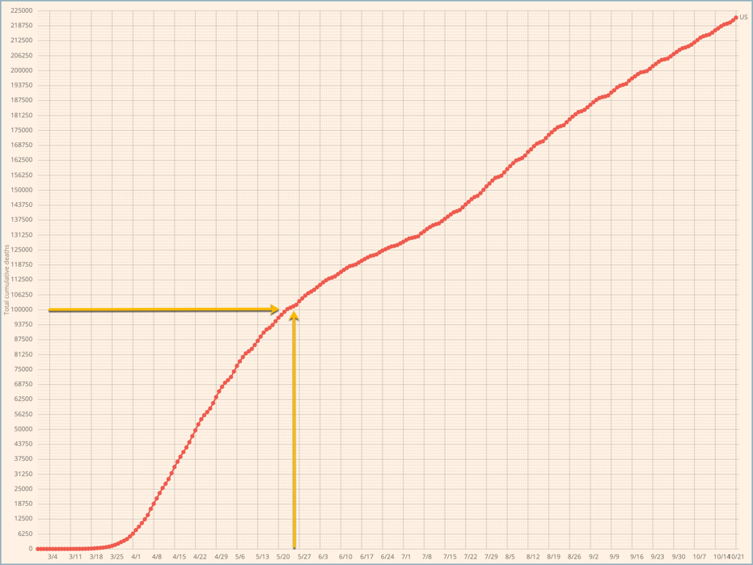

---
jupyter:
  jupytext:
    formats: ipynb,md
    text_representation:
      extension: .md
      format_name: markdown
      format_version: '1.2'
      jupytext_version: 1.7.1
  kernelspec:
    display_name: Python 3
    language: python
    name: python3
---

# Impact of Trump super-spreader rallies on COVID-19 deaths in United States #


This project investigates the possible effects of Trump campaign rallies on the spread of COVID-19 during the summer and early fall of 2020.


## Background and Motivation ##


Prior to May 25, 2020, COVID-19 deaths in the United States were falling precipitously. On May 25th, that descent slowed dramatically, and then, around the beginning of July, reversed itself, starting a second wave of COVID-19 deaths in the United States. The number of deaths in this second wave, 125K, now exceeds that of the first wave, 100K.

The date, May 25, 2020, is significant in that it is the date on which George Floyd died while in police custody in Minneapolis, MN. Subsequent to Floyd's death, protests occurred in over 2,000 cities in the United States. It has been suggested that the George Floyd Protests might have contributed to triggering the second wave of COVID-19. 

This "hypothesis" is confounded, however, by summer political campaigning in the run up to the 2020 Elections. In particular, President Trump was notable for holding campaign rallies in which the president did not follow normative behavior to control COVID-19 infections and neither did many of the rally attendees--possibly following the president's lead. These became known as _super-spreader rallies_. Some news agencies have reported that COVID-19 infections spiked in the areas where these rallies had been recently held. However, I have not found a _systematic_ investigation of whether and to what extent the rallies were correlated with COVID-19 spread.


_**The yellow arrows in the two graphs below identify May 26, 2020, that is, the day after George Floyd died while in police custody.**_


### COVID-19 deaths: Seven day moving average ###


### COVID-19 deaths: Cumulative ###




## Research Questions and Hypothesis ##


The key question is whether it is possible to identify increases in mortality from COVID-19 subsequent to President Trump's rallies and also relatively proximal to where the rallies were held. And further, to see if these increases are greater than we would expect when compared to changes in COVID-19 mortality during the same times periods in other locations.

My hypothesis is that I _can_ identify increases in COVID-19 mortality associated with President Trump's rallies and that these increases are greater than we would expect based on contemporaneous COVID-19 mortality in other areas.


## Data ##


For data that indicates the spread of COVID-19, I will use the _COVID-19 Data Repository by the Center for Systems Science and Engineering (CSSE) at Johns Hopkins University_ hosted on GitHub at the following URL:

>  <https://github.com/CSSEGISandData/COVID-19>

For data on President Trump's campaign rallies, I will use the list maintained on Wikipedia at the following URL:

>  <https://en.wikipedia.org/wiki/List_of_post-election_Donald_Trump_rallies#2020_campaign_rallies>


## Methodology ##


The Johns-Hopkins data tracks COVID-19 deaths per county in the United States. Using geocoding, I can convert the City-State locations for President Trump's rallies into county locations. I should then be able to gather statistics for each of the counties which are also supported by the Johns-Hopkins data.

I can also gather similar statistics for a set of counties where President Trump did _not_ hold rallies and use these as something analogous to _controls_.

Specifically, the questions that I will investigate are, for each of the Trump rallies:

- What was the change in the seven-day moving average for COVID-19 deaths in the 60 days _**before**_ the date of the Trump rally in that county--and in each of the control counties.
- What was the change in the seven-day moving average for COVID-19 deaths in the 60 days _**after**_ the date of the Trump rally in that county--and in each of the control counties.

- What was the total accumulated COVID-19 deaths in the 60 days _**before**_ the date of the Trump rally in that county--and in each of the control counties.
- What was the total accumulated COVID-19 deaths in the 60 days _**after**_ the date of the Trump rally in that county--and in each of the control counties.

And also:

- Compare summary statistics (mean, median, std) for accumulated COVID-19 deaths in the Trump counties vs the control counties.

To be clear, I will look at COVID-19 deaths in the control counties before and after the date of each Trump rally _even though no Trump rally occurred in that county_.


## Unknowns ##


I have, so far, identified a couple unknowns that could affect the success of this investigation.

One unknown is that Trump's rallies were not always held in an urban center. For example, some were held at airports. The president would fly in, speak at a rally at the airport, and then fly out. **In these cases, it is not certain where the attendees originated from; that is, we can't assume that they came from the nearest urban center.** 

To take an example, on September 3, 2020, Trump spoke at a rally at Arnold Palmer Regional Airport outside Latrobe, PA. However, we can't necessarily infer from this that all the attendees were from Latrobe; they might have traveled in from out of area. More importantly, we don't know where the attendees traveled _to_ after the rally. 

(Actually, this issue, that attendees might reside outside the area where the rally was held, applies to some degree even for rallies held inside city centers.)

**Another unknown is that the locations of Trump's rallies are not uniformly distributed across the United States.** This could be for reasons such as campaign strategy. But in any case, regional differences between areas that hosted the rallies and those that didn't could introduce bias into the data.

```python
import os
import geocoder
import pandas as pd
```

```python
#
# Note that the BING_API_KEY variable needs to be set with your API key
# in the console window from which you launch this Jupyter notebook.
#
g = geocoder.bing( 'Kenosha,s WI', key=os.environ[ 'BING_API_KEY' ] )

print( g.json[ 'raw' ][ 'address' ][ 'adminDistrict2' ] )
```

```python
trump_rallies = pd.read_csv('data/trump-rallies.csv', 
        sep=',', 
        skipinitialspace=True,
        header=0,
        na_values='?')
```

```python
trump_rallies.columns
```

```python
trump_rallies.head()
```

```python
trump_rallies.shape
```

```python
trump_rallies.iloc[ 0, 1 ]
```

```python
trump_rallies.loc[ 0, "State" ]
```

```python
target_location = trump_rallies.loc[ 0, "City" ] + ", " + trump_rallies.loc[ 0, "State" ]
g = geocoder.bing( target_location, key=os.environ[ 'BING_API_KEY' ] )
target_location
```

```python
g = geocoder.bing( trump_rallies.loc[ 0, "City" ] + ", " + trump_rallies.loc[ 0, "State" ], key=os.environ[ 'BING_API_KEY' ] )
```

```python
geocoder.bing( trump_rallies.loc[ 0, "City" ] + ", " + trump_rallies.loc[ 0, "State" ], key=os.environ[ 'BING_API_KEY' ] ).json[ 'raw' ][ 'address' ][ 'adminDistrict2' ]
```

```python
print( g.json[ 'raw' ][ 'address' ][ 'adminDistrict2' ] )
```

```python
trump_rallies.loc[ : , 'County' ] = geocoder.bing( trump_rallies.loc[ 0, "City" ] + ", " + trump_rallies.loc[ 0, "State" ], key=os.environ[ 'BING_API_KEY' ] ).json[ 'raw' ][ 'address' ][ 'adminDistrict2' ]
```

```python
def gcode( row ):
    return( geocoder.bing( row[ 'City' ] + ", " + row[ 'State' ], key=os.environ[ 'BING_API_KEY' ] ).json[ 'raw' ][ 'address' ][ 'adminDistrict2' ] )
```

```python
def gcode( row ):
    return( geocoder.bing( 'Kenosha' + ", " + 'WI', key=os.environ[ 'BING_API_KEY' ] ).json[ 'raw' ][ 'address' ][ 'adminDistrict2' ] )
```

```python
def gcode_np():
    return( geocoder.bing( 'Kenosha' + ", " + 'WI', key=os.environ[ 'BING_API_KEY' ] ).json[ 'raw' ][ 'address' ][ 'adminDistrict2' ] )
```

```python
geocoder.bing( 'Kenosha' + ", " + 'WI', key=os.environ[ 'BING_API_KEY' ] ).json[ 'raw' ][ 'address' ][ 'adminDistrict2' ]
```

```python
gcode_np()
```

```python
trump_rallies[ 'County' ] = trump_rallies.apply( gcode, axis = 1 )
```

```python
trump_rallies.loc[ : , 'County' ].head()
```

### --- END --- ###

```python

```
